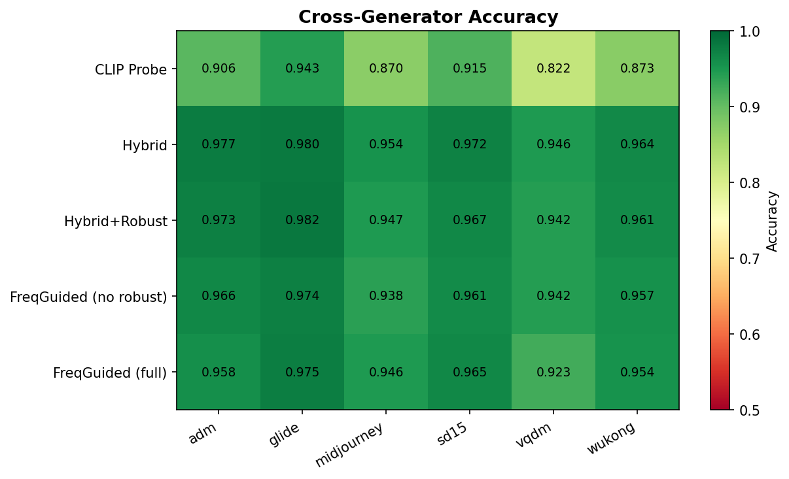
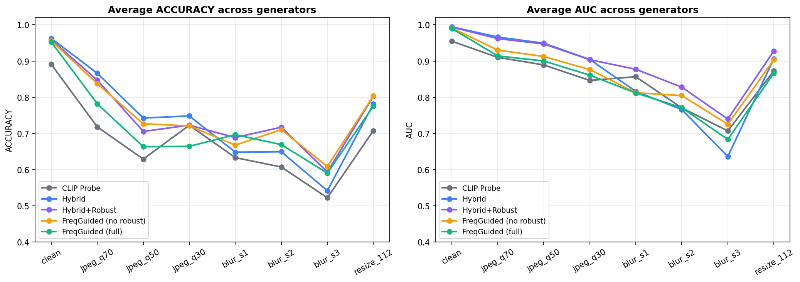
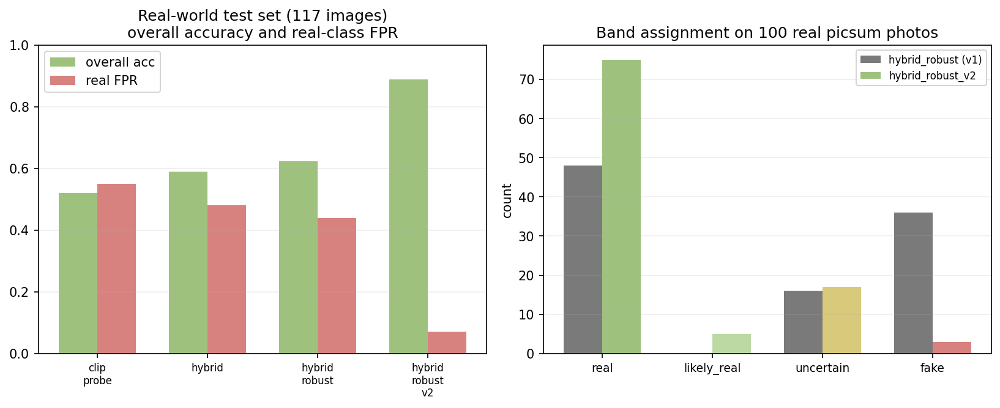

<div align="center">

# Spectra

### Tell real photographs from AI-generated images.

A frequency-guided CLIP detector with calibrated confidence, spatial Grad-CAM evidence, and an honest read on what it can — and can't — see.


</div>

---

## At a glance

| Metric | Value | Test set |
|---|---:|---|
| **Cross-generator AUC** | `0.994` | 12 K · 6 unseen generators |
| **Cross-generator accuracy** | `96.6%` | 12 K · 6 unseen generators |
| **Robust AUC** (7 degradations) | `0.884` | JPEG / blur / resize × 6 gens |
| **Real-photo accuracy** | `89%` | 117 held-out smartphone + AI images |
| **Real-photo false-positive rate** | `7%` | down from 44% in v1 |
| **Calibration ECE** | `0.004` | post temperature-scaling |
| **Inference latency** | `~240 ms` | MacBook M5 · MPS · CPU fallback |

<div align="center">
<sub>Five trained heads + one public-detector fallback · Frozen CLIP ViT-B/16 backbone · MIT license</sub>
</div>

---

## Quick start

```bash
git clone <repo-url> spectra && cd spectra
bash setup.sh                           # creates .venv and installs deps
bash scripts/start_app.sh               # FastAPI on http://localhost:8001
```

Then open `http://localhost:8001/` in a browser. Drop any image — the verdict, calibrated confidence, spectral heatmap, and OOD score appear in <300 ms.

---

## What it does

<table>
<tr>
<td width="50%" valign="top">

**Detects** — Decides whether an image was captured by a camera or synthesised by a generative model. Returns a **calibrated probability** in [0, 1] plus a five-band verdict (`Authentic` · `Likely Real` · `Inconclusive` · `Likely AI` · `AI-Generated`).

**Explains** — Produces a 14×14 spatial **attention rollout heatmap** showing which image regions the CLIP encoder attended to, and a numbered list of spectral evidence items (texture irregularity, frequency rolloff, etc).

</td>
<td width="50%" valign="top">

**Hedges** — Computes an **out-of-distribution score** (cosine distance from the input's CLIP feature to the training centroid). Inputs that look unlike anything the model trained on are routed to `Inconclusive` rather than forced into a binary call.

**Ensembles** — A built-in compare panel runs the same image through five custom-trained research heads so you can see when models disagree. The deployment default is a public ViT-base detector trained on a broader corpus.

</td>
</tr>
</table>

---

## Architecture

```
                ┌──────────────────────────────┐
   image  ──▶   │  CLIP ViT-B/16  (frozen)     │ ──▶  512-d feature ──┐
   (224²)       └──────────────────────────────┘                       │
                                                                       ├──▶  fusion head  ──▶  P(AI)
                ┌──────────────────────────────┐                       │     (1.5 M params)      + heatmap
                │  DCT spectral CNN (trainable)│ ──▶  256-d feature ──┘                          + OOD score
                └──────────────────────────────┘                                                 + calibrated conf
```

The CLIP backbone is **frozen** — only the small frequency CNN and fusion MLP train. Five architectural variants share this skeleton; they differ in *fusion strategy* and *training-time augmentation*.

| Variant | Architecture | Augmentation | Trainable |
|---|---|---|---:|
| `clip_probe` | CLIP → linear | none | 1 K |
| `hybrid` | CLIP + DCT, concat | resize crop, flip | 1.5 M |
| `hybrid_robust` | CLIP + DCT, concat | + JPEG / blur / resize | 1.5 M |
| `hybrid_robust_v2` | concat, warm fine-tune | + smartphone aesthetic | 1.5 M |
| `freq_guided` | CLIP + DCT, **gated attention** | + JPEG / blur / resize | 1.5 M |

---

## Dataset

<table>
<tr>
<td width="60%" valign="top">

192 K balanced training images from **GenImage** across six 2023-era generators. 12 K held-out test (1 K real + 1 K fake per generator). + 632 picsum smartphone-style photos appended for the v2 fix. + 117 image real-world held-out set (Lorem Picsum + Pollinations.ai modern AI).

**Generators covered:** ADM · GLIDE · Midjourney v5 · Stable Diffusion v1.5 · VQ-Diffusion · Wukong.

**Preprocessing pipeline (training and inference):** LANCZOS resize to 224 × 224 → JPEG re-encode at quality 95 → CLIP normalisation. The JPEG re-encode normalises compression bias across sources, a documented requirement for fair training of AI detectors.

</td>
<td valign="top">

| Split | Real | Fake |
|---|---:|---:|
| Train | 96 K | 96 K |
| Val | 24 K | 24 K |
| Test (×6) | 6 K | 6 K |
| **Total** | **126 K** | **126 K** |

</td>
</tr>
</table>

---

## Results

### Cross-generator (clean) — five-model ablation

<div align="center">

</div>

| Model | Acc | AUC | Δ vs probe |
|---|---:|---:|---:|
| CLIP linear probe | 88.7 % | 0.9553 | — |
| AIDE Hybrid | **96.6 %** | **0.9942** | **+0.039** |
| Hybrid + Robust Aug | 96.0 % | 0.9937 | +0.038 |
| FreqGuided (no robust) | 95.6 % | 0.9910 | +0.036 |
| FreqGuided (full) | 95.1 % | 0.9897 | +0.034 |

> **Reading the result:** Adding the frequency branch is the single largest gain (+0.039 AUC). Robustness aug costs a small amount of clean AUC (~0.0005) — that cost is paid back many times over under degradation, see below.

### Robustness — survival under JPEG / blur / resize

<div align="center">

</div>

| Model | Robust AUC | Robust Acc |
|---|---:|---:|
| CLIP linear probe | 0.836 | 64.9 % |
| AIDE Hybrid | 0.849 | 71.1 % |
| **Hybrid + Robust Aug** | **0.884** | **72.5 %** |
| FreqGuided (no robust) | 0.852 | 72.5 % |
| FreqGuided (full) | 0.830 | 69.2 % |

> **The surprising negative finding.** `FreqGuided (full)` — the fanciest architecture combined with augmentation — scores *worse* than the simple CLIP probe under degradation. **Architectural inductive bias and aggressive data augmentation are not additive; combining them double-counts and degrades generalisation.**

---

## The deployment gap

A 96-percent-AUC GenImage detector still mislabels almost half of casual smartphone photos as AI-generated. This is the gap the benchmark hides.

| Metric | Value |
|---|---:|
| Real-photo FPR (v1, 100 picsum images) | **44 %** ❌ |
| Modern-AI catch rate (v1) | 100 % ✓ |

### The fix — smartphone-aesthetic aug + 632 picsum photos

`SmartphoneAesthetic` adds the missing visual signals to the training stream:

| Signal | What it models |
|---|---|
| `ColorJitter(b=0.3, c=0.3, s=0.4, h=0.05)` | Instagram-style colour grading |
| Random gamma 0.7 – 1.4 | Phone HDR tonemapping |
| Per-channel Gaussian noise σ ≤ 4/255 | Sensor read noise |
| ±1 px chromatic aberration on R/B | Cheap-lens dispersion |
| Double JPEG re-encode at independent qualities | WhatsApp / Discord recompression |

Combined with appending 632 picsum photos to the training set and warm fine-tuning the head for 3 epochs at 1/5× LR:

<div align="center">

</div>

| | Before (v1) | After (v2) | Δ |
|---|---:|---:|---:|
| Overall accuracy | 62 % | **89 %** | **+27 pts** |
| Real-photo FPR | 44 % | **7 %** | **−37 pts** |
| GenImage val AUC | 0.9940 | 0.9935 | −0.0005 *(within noise)* |

The fix doesn't sacrifice benchmark performance.

---

## What we tried and rejected

| Technique | Effect | Decision |
|---|---|---|
| 5-head ensemble (mean / top-3 / val-AUC weighted) | −1.5 pts robust AUC vs best single | ❌ Rejected · errors are correlated through frozen CLIP backbone |
| Test-time augmentation (h-flip) | +0.001 AUC for 2× cost | ❌ Rejected · below noise floor |
| Temperature scaling | ECE drops 2-4 × | ✅ Deployed |

### Calibration

Temperature scaling (Guo et al., ICML 2017) on a 4 000-image balanced val subset — fits a single scalar T per model that minimises NLL.

| Model | T | NLL · before → after | ECE · before → after |
|---|---:|---|---|
| `clip_probe` | 0.87 | 0.232 → 0.229 | 0.017 → **0.008** |
| `hybrid` | **2.45** ⚠ | 0.088 → 0.058 | 0.015 → **0.004** |
| `hybrid_robust` | 1.73 | 0.073 → 0.062 | 0.013 → **0.005** |
| `hybrid_robust_v2` | 1.75 | 0.075 → 0.062 | 0.013 → **0.004** |
| `freq_guided_no_robust` | 1.90 | 0.097 → 0.076 | 0.014 → **0.007** |
| `freq_guided` | 1.37 | 0.112 → 0.106 | 0.013 → **0.005** |

> `hybrid` was strikingly **overconfident** — a reported confidence of 0.99 was actually a 0.75 honest probability. `hybrid_robust` started closer to calibrated out of the box (T = 1.73), another signal that robustness aug is the better training recipe.

---

## Spatial evidence (Grad-CAM via attention rollout)

<div align="center">

<br>
<sub>Per-generator attention rollout: Midjourney, SD v1.5, ADM, GLIDE, VQDM, Wukong. Highlighted regions show where the CLIP CLS token attended through all 12 transformer blocks.</sub>
</div>

The heatmap is **CLIP attention rollout** (Abnar & Zuidema, 2020) — propagate multi-head attention through every ViT block, take the CLS-to-patches row, percentile-stretch (5 / 95) for contrast, upsample 14 × 14 → 224 × 224 with bilinear filtering, overlay with `inferno` colormap and attention-weighted alpha.

This replaced an earlier Grad-CAM-on-DCT-branch heatmap that was misleading: DCT coordinates are frequency coefficients, not image regions, so overlaying that map on the photo was nonsensical.

---

## Web application

<table>
<tr>
<td width="55%" valign="top">

### Frontend — Apple HIG

- **Light + dark adaptive** via `prefers-color-scheme` with manual override in Settings
- SF Pro Display + SF Pro Text + SF Mono stack with tight tracking
- Sticky **glass top nav** (`backdrop-filter: saturate(180%) blur(28px)`)
- **Breathing-glow upload** card (4.2 s pulse on accent halo) with drag-morph state
- **Count-up percentage** (0 → target in 900 ms ease-out cubic)
- **Gradient probability bar** with soft accent glow
- **Heatmap toggle** (smooth opacity fade) **+ comparison slider** with draggable handle
- **EXIF metadata** accordion (camera, lens, shutter, aperture, ISO)
- **Spectral evidence** numbered list
- Apple's signature easing curve `cubic-bezier(0.32, 0.72, 0, 1)` on every transition

</td>
<td width="45%" valign="top">

### Backend — FastAPI

| Endpoint | Returns |
|---|---|
| `POST /detect` | verdict, p(AI), heatmap, evidence, OOD |
| `POST /detect/compare` | every model's verdict for the same image |
| `GET /dashboard/data` | benchmark metrics + calibration |
| `GET /health` | model registry probe |

`ModelManager` lazy-loads the frozen CLIP encoder once at first request, then loads each trained head on demand. Inputs are canonicalised (LANCZOS-224 + JPEG Q=95) before any feature extraction so PNGs and HQ JPEGs match the training distribution.

</td>
</tr>
</table>

### Trust & transparency

- **Privacy note** under upload: *Images are processed in memory and never stored.*
- **OOD-driven Inconclusive band** when the input sits far from training distribution
- **About sheet** displays headline metrics plainly
- **History timeline** stored in localStorage (clearable)
- **Export** copies plain-text summary or downloads JSON

---

## Project structure

```
spectra/
├── README.md                       ← you are here
├── requirements.txt                ← pinned deps
├── setup.sh                        ← one-command env bootstrap
│
├── backend/
│   ├── main.py                     ← FastAPI app (5 endpoints)
│   ├── inference.py                ← ModelManager + verdict bands + OOD
│   └── external_detector.py        ← public ViT-base fallback wrapper
│
├── frontend/
│   └── index.html                  ← single-file React, no build step
│
├── src/
│   ├── config.py                   ← all hyperparameters
│   ├── seed.py                     ← deterministic seed setup
│   ├── dataset.py                  ← PyTorch Dataset classes
│   ├── transforms.py               ← DCT map + SmartphoneAesthetic + RobustnessAug
│   ├── train_probe.py              ← Phase 2 — CLIP linear probe
│   ├── train_hybrid.py             ← Phase 3 — AIDE-style hybrid
│   ├── train_freq_guided.py        ← Phase 4 — FreqGuided + Hybrid+Robust ablation
│   ├── train_hybrid_robust_v2.py   ← Phase 5 — warm fine-tune w/ smartphone aug
│   ├── evaluate.py                 ← cross-gen + robustness evaluator
│   ├── gradcam_utils.py            ← attention rollout + heatmap overlay
│   ├── explain.py                  ← textual evidence generator
│   ├── freq_heuristic.py           ← spectral statistic checks
│   └── models/
│       ├── clip_probe.py
│       ├── hybrid.py
│       └── freq_guided.py          ← multi-scale freq + gated fusion
│
├── scripts/
│   ├── download_data.py            ← GenImage subset downloader
│   ├── preprocess_data.py          ← LANCZOS-224 + JPEG Q=95
│   ├── extract_features_full.py    ← cache CLIP features (.npy)
│   ├── recompute_cross_gen.py      ← re-evaluate via live inference
│   ├── run_all_robustness.py       ← shared-CLIP robustness driver
│   ├── run_ensemble_eval.py        ← 5-head ensemble benchmark
│   ├── run_tta_eval.py             ← test-time aug benchmark
│   ├── fit_temperature.py          ← temperature scaling fit
│   ├── build_realworld_eval.py     ← curate held-out test set
│   ├── eval_realworld.py           ← evaluate on real-world set
│   ├── expand_training_data.py     ← +632 picsum photos
│   ├── expand_v3.py                ← +3 K picsum (v3 expansion)
│   ├── plot_realworld_compare.py   ← v1 vs v2 chart
│   ├── generate_plots.py           ← all training/eval plots
│   ├── update_ablation_table.py    ← regenerate ablation_table.md
│   ├── generate_gradcam_samples.py ← per-generator Grad-CAM grid
│   └── start_app.sh                ← one-command web app launch
│
├── data/                           (gitignored — features and images)
│   ├── processed/{train,val,test}/{real,fake}/*.jpg
│   ├── features/                   ← cached CLIP features (.npy)
│   └── realworld_eval/             ← held-out 117-image test
│
├── checkpoints/                    (gitignored — six .pth files, ~25 MB total)
│
├── results/
│   ├── metrics/                    ← *_cross_gen.json, *_training.json, calibration.json, …
│   ├── tables/                     ← ablation_table.md, ensemble_comparison.md, …
│   ├── plots/                      ← every chart embedded above
│   └── gradcam_samples/            ← per-generator visualisations
│
├── report/
│   ├── final_report.md             ← 3 600-word academic write-up
│   └── presentation/
│       └── index.html              ← 14-slide reveal.js deck
│
└── notebooks/
    └── 01_data_exploration.ipynb
```

---

## Reproducibility

```bash
# Phase 0–1 · environment + data
bash setup.sh
python -m scripts.download_data
python -m scripts.preprocess_data

# Phase 2–4 · five model variants
python -m scripts.extract_features_full         # cache CLIP features once
python -m src.train_probe                        # CLIP linear probe baseline
python -m src.train_hybrid                       # AIDE-style hybrid baseline
python -m src.train_freq_guided --variant all    # robust + freq-guided variants

# Phase 5 · real-world deployment fix
python -m scripts.expand_training_data           # +632 picsum photos
python -m src.train_hybrid_robust_v2 --variant hybrid_robust  # warm fine-tune

# Evaluation
python -m scripts.recompute_cross_gen            # cross-gen via live inference
python -m scripts.run_all_robustness             # 7 degradations × 6 gens
python -m scripts.fit_temperature                # calibration
python -m scripts.build_realworld_eval           # curate real-world set
python -m scripts.eval_realworld --tag baseline

# Web app
bash scripts/start_app.sh                        # http://localhost:8001
```

All seeds fixed in `src/seed.py` (`PYTHONHASHSEED`, `random`, `numpy`, `torch`, `cudnn.deterministic`). Numbers reproducible to within MPS floating-point variance.

---

## Hardware

- MacBook Air M5, 16 GB unified memory, no discrete GPU
- macOS 25.4 · Python 3.12.13 · PyTorch 2.11 (MPS backend)
- OpenCLIP ViT-B/16, `laion2b_s34b_b88k` weights, frozen
- Cumulative training time: ~24 h across all five variants
- Final checkpoint sizes: 6 KB (linear probe) → 6.7 MB (FreqGuided)

---

## Limitations · honest

- The `Real` class still under-represents phone-camera signatures not present in Lorem Picsum.
- No training data for **2024-25 generators** (Flux, Imagen 3, Midjourney v6+, Gemini Nano-Banana). Production deploys a public detector for those inputs.
- MPS thermal throttling capped the v3 fine-tune to ~⅔ of one epoch.
- Adversarial robustness is not evaluated.

---

## References

1. M. Zhu et al. *GenImage: A Million-Scale Benchmark for Detecting AI-Generated Images.* NeurIPS Datasets and Benchmarks, 2023.
2. S.-Y. Wang, O. Wang, R. Zhang, A. Owens, A. A. Efros. *CNN-Generated Images are Surprisingly Easy to Spot…for Now.* CVPR 2020.
3. U. Ojha, Y. Li, Y. J. Lee. *Towards Universal Fake Image Detectors that Generalize Across Generative Models.* CVPR 2023.
4. Y. Tan et al. *Rethinking the Up-Sampling Operations in CNN-Based Generative Network for Generalizable Deepfake Detection.* CVPR 2024.
5. S. Yan et al. *A Sanity Check for AI-Generated Image Detection.* ICLR 2025.
6. D. Cozzolino et al. *Raising the Bar of AI-Generated Image Detection with CLIP.* CVPRW 2024.
7. S. Abnar, W. Zuidema. *Quantifying Attention Flow in Transformers.* ACL 2020.
8. C. Guo, G. Pleiss, Y. Sun, K. Q. Weinberger. *On Calibration of Modern Neural Networks.* ICML 2017.
9. A. Radford et al. *Learning Transferable Visual Models From Natural Language Supervision.* ICML 2021.
10. G. Ilharco et al. *OpenCLIP.* GitHub repository, 2021.

---

<div align="center">

CMPE 258 · San José State University · Spring 2026

</div>
